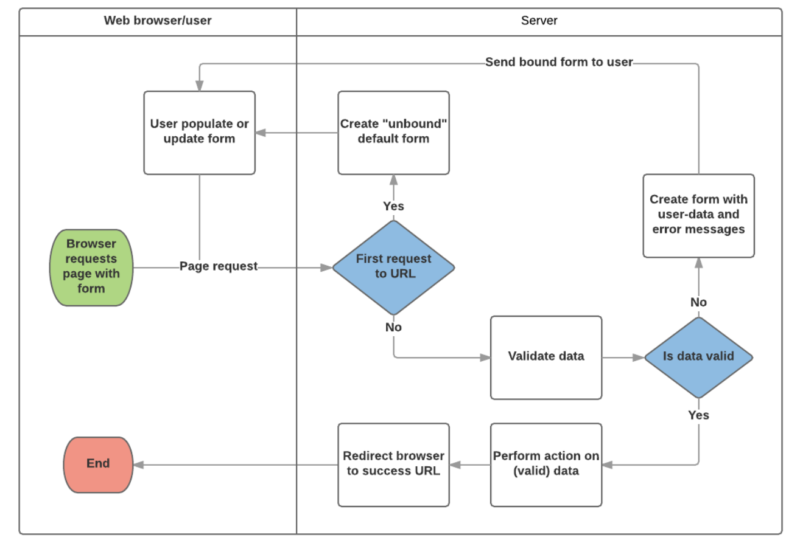

##  class has no objects member 에러 

```python
# 1.설치
pip install pylint_django

# 2. vscode 사용자 설정 추가
"""
"python.linting.pylintArgs": [
    "--load-plugins=pylint_django"
]
"""
```
1. 오류가 발생하는 모델수정
```python
class Fcuser(models.Model):
    # 추가
    objects = models.Manager()
    email = models.EmailField(verbose_name='이메일')
    password = models.CharField(max_length=64, verbose_name='비밀번호')
    register = models.DateField(auto_now_add=True, verbose_name='등록날짜')
    ...
```

## [Humanize 사용](https://docs.djangoproject.com/en/2.2/ref/templates/builtins/)
1. 휴머나이즈 필터는 날짜, 숫자 등을 사람 눈에 더 친숙하게 바꿔주는 필터를 제공
1. 해당 필터를 사용하기 위해선 settings.py에 `django.contrib.humanize`를 app으로 등록필요
1. 사용을 원하는 html 파일에서 를 통해 로드

```python
# setting.py

INSTALLED_APPS = [
    ...
    # humanize filter를 사용하기 위해 app 사용등록 필요함
    'django.contrib.humanize',  
]
```
```html
<!-- some.html -->
...

...
<!-- ilter를 적용할 때에는 | 를 입력 후 원하는 filter를 적용 -->
<!--  intcomma는 숫자 3개마다 ,를 붙여주는 filter -->
<td>{{ product.price|intcomma }} 원</td>
<!--  date는 날짜관련 filter -->
<td>{{ product.register_data|date:"Y-m-d h:i" }}</td>
```


## webeditor
- [summernote](https://summernote.org/) : 간단하게 적용가능


## TemplateView 

```python
# urls.py
# MyView라는 클래스 뷰를 사용

from django.conf.urls import url
from myapp.views import AboutView

urlpatterns = [
	url(r'^about/$', AboutView.as_view())
	]
"""
- as_view()
1. as_view()는 url 해석기에서 class view로 진입하기 위한 매소드
2. 클래스의 인스턴스를 생성하고 그 인스턴스의 dispatch() 매소드를 호출
3. dispatch() 메소드는 요청을 검사하여 HTTP 요청 메소드를 알아낸 다음, 인스턴스 내에 해당 이름을 갖는 메소드로 요청을 중계한다
4. 요청에 맞는 메소드가 없으면 에러 발생
"""    
---

# views.py
# /about/ url로 요청이 들어오면 about.html을 보여주는 TemplateView

from django.views.generic import TemplateView

class AboutView(TemplateView):
	template_name = 'about.html'

``` 
## Django Form 처리과정

위의 다이어그램에 기반하여, Django 폼이 주요하게 다루는 것은 다음과 같다. 

1. 사용자가 처음으로 폼을 요청할 때 기본 폼을 보여준다.
    - 폼은 비어있는 필드가 있을 수 있다 (예를 들면, 새로운 책을 등록할 경우) 아니면 
    초기값으로 채워진 필드가 있을 수도 있다. ( 예를 들면, 기존의 책을 수정하거나, 흔히 사용하는 초기값이 있을경우)
    - 이 시점의 폼은 (초기값이 있긴해도) 유저가 입력한 값에 연관되지 않았기에  unbound 상태라고 불린다.
1. 제출 요청으로 부터 데이타를 수집하고 그것을 폼에 결합한다.
    - 데이타를 폼에 결합(binding) 한다는 것은 사용자 입력 데이타와 유효성을 위반한 경우의 에러메시지가 폼을 재표시할 필요가 있을 때 준비되었다는 의미이다.
1. 데이타를 다듬어서 유효성을 검증한다.
    - 데이타를 다듬는다는 것은 사용자 입력을 정화(sanitisation) 하고 (예를 들면, 잠재적으로 악의적인 콘덴츠를 서버로 보낼수도 있는 유효하지 않은 문자를 제거하는 것)  python에서 사용하는 타입의 데이타로 변환하는 것이다.
    - 유효성검증은 입력된 값이 해당 필드에 적절한 값인지 검사한다. (예를 들면, 데이타가 허용된 범위에 있는 값인지, 너무 짧거나 길지 않은지 등등) 
1. 입력된 어떤 데이타가 유효하지 않다면, 폼을 다시 표시하는데 이번에는 초기값이 아니라 유저가 입력한 데이타와 문제가 있는 필드의 에러 메시지와 함께 표시한다.
1. 입력된 모든 데이타가 유효하다면, 요청된 동작을 수행한다. (예를 들면, 데이타를 저장하거나, 이메일을 보내거나, 검색결과를 반환하거나, 파일을 업로딩하는 작업 등등)
1. 일단 모든 작업이 완료되었다면, 사용자를 새로운 페이지로 보낸다.

- 참고사이트
>https://developer.mozilla.org/ko/docs/Learn/Server-side/Django/Forms

## FormView 
```python
# views.py
# MyForm 폼클래스를 적용하여 about.html을 보여주고 

from django.views.generic.edif import FormView
 
class AboutView(FormView):
    # MyForm를 forms에 정의해야함
    form_class = MyForm 
    template_name = 'about.html'
    success_url = 'thanks'
 
    def form_valid(self, form):
        # cleaned_data로 관련 로직 처리
        return super().form_valid(form)
    
    # 폼을 생성할때 어떤 인자값을 전달해서 만들지 결정
    # Form 첫 방문일때 기본적으로 Form 생성하고 전달하지만
    # http method가 Post, Put 일때 첫 방문이라도 폼을 만들어서 전달한다.
    # 아래는 session를 사용하기 위해  request를 넣는 작업을 한다.
    def get_form_kwargs(self, **kwargs):
        print("===== get_from_kwargs ======")
        kw = super().get_form_kwargs(**kwargs)
        kw.update({
            'request': self.request
        })

        return kw
```
- form_class : 사용자에 보여줄 폼을 정의한 forms.py 파일 내의 클래스명
- template_name : 폼을 포함하여 렌더링할 템플릿 파일 이름
- success_url : MyFormView 처리가 정상적으로 완료되었을 때 리다이렉트시킬 URL
- form_valid() 함수 : 유효한 폼 데이터로 처리할 로직 코딩, 반드시 super() 함수 호출.

## ListView
- 글 목록이 전체를 표시하거나, 특정 DB table의 전체를 표시할 대 활용할 수 있다.
- 리스트가 테이블의 모든 레코드인 경우 모델 클레스만 지정하면 된다.
```python

# urls.py
from product.views import ProductList

urlpatterns = [
    path('product/', ProductList.as_view()),
]

---

# views.py
from django.views.generic import ListView
from .models import Product

class ProductList(ListView):    
    # 모델지정
    model = Product
    # 사용할 template 파일
    template_name = 'product.html'
    # object 명칭 지정
    # default context : object_list
    context_object_name = 'product_list'

```
```html
...
<!-- context 사용 -->

<tr>
    <td scope="row">{{ product.id }}</td>
    <td>{{ product.name }}</td>
    <td>{{ product.price|intcomma }} 원</td>
    <td>{{ product.register_data|date:"Y-m-d h:i" }}</td>
</tr>

...
```

## [DetailView](https://docs.djangoproject.com/ko/3.0/ref/class-based-views/generic-display/)
- DB table의 특정 record 를 상세내용을 표시할 때 활용할 수 있다. 
- 조회시 사용할 Primary Key 값은 URLconf에서 추출하여 뷰로 넘어온 파라미터(pk)를 사용한다.
```python
# urls.py
from product.views import ProductDeatil

urlpatterns = [
    ....
    path('product/<int:pk>/', ProductDeatil.as_view()),
]

---

# views.py
from django.shortcuts import render
from django.views.generic import ListView, DetailView
from .models import Product


class ProductDeatil(DetailView):
    # 디폴트 템플릿명: <app_label>/<model_name>_detail.html
    template_name = 'product_detail.html'
    # 기본적으로는 모델의 모든 객체들을 전부 반환하지만 위에서 qureyset 이 지정이 되어 있다면 그 queryset 에 맞게 객체를 return 합니다.
    queryset = Product.objects.all()
    # 디폴트 컨텍스트 변수명 :  object
    context_object_name = 'product'

# 디폴트 설정을 그대로 사용한다면 아래와 같이 간단하게 작성할 수 있다
# class ProductDeatil(DetailView):
    # 해당 모델 - URLConf 의 PK 변수를 활용하여 해당 모델의 특정 record를 컨텍스트 변수(object)에 담는다.
    # model = Product 

```
- 참고사이트
>https://ssungkang.tistory.com/entry/Django-CBV-2-Generic-display-views
https://wayhome25.github.io/django/2017/05/02/CBV/  

## Decorator
- 함수를 Wrapping 하는 기법으로 반복되는 코드를 줄일 수 있다는 장점이 있습니다. 
- 공통으로 처리해야 할 action이 있다면 효율적으로 활용가능하다.
- 함수 또는 클래스에 사용할 수 있다. 
```python
# decorators.py
"""규칙
1. 인수로 함수를 받는다.
2. wrap 함수를 반드시 return 해야한다.
3. wrap 함수에서 인수로 받는 함수를 호출할때는 함수를 호출할때와 동일하게 맞춰줘야 한다.
"""
def login_required(func):

    def wrap(request, *args, **kwargs):
        user = request.session.get('user')
        # None 이거나 빈값이면
        if user is None or not user:
            return redirect('/login')

        print('login_require')
        return func(request, *args, **kwargs)

    return wrap

---

#  product/views.py
"""
class에 사용시 필요한 임포트와 사용법
1. from django.utils.decorators import method_decorator
2. @method_decorator(decorator, name="메소드 이름")
"""
from django.utils.decorators import method_decorator

@method_decorator(admin_required, name='dispatch')
class ProductCreate(FormView):
    template_name = 'register_product.html'
    form_class = RegisterForm
    success_url = '/product/'

# 함수에 사용
@admin_required
def decoTest():
    print('use decorator to function')
```

### django rast freamwork
- 설치 : pip install djangorestframework
- setting app등록
````python
# settings.py
INSTALLED_APPS = [
    # ...
	'rest_framework'
	# ...
]

---

# serializers.py

"""
Serializer 는 REST 로 데이터를 주고 받을 때, 모델을 어떻게 주고 받을 것인가를 정의하기 위한 클래스이다.
이것은 객체와 같은 보기 힘든 데이터를 JSON이나 XML처럼 보기 쉽게 데이터를 바꾸어 통신하게 해주는 역활을 한다.
"""
 
from rest_framework import serializers
from .models import Product

class ProductSerializer(serializers.ModelSerializer):

	class Meta:
		model = Product
		# fiedls 를 명시하지 않으면 기본적으로 모델의 전체 필드를 가져온다.
		fields = '__all__'
        # fields = ('id', 'name', 'price', 'description', 'stock')

---
# views.py
from rest_framework import generics
from rest_framework import mixins
from .serializers import ProductSerializer

class ProductListAPI(generics.GenericAPIView, mixins.ListModelMixin):
	serializer_class = ProductSerializer
    # queryset = Product.objects.all()

	def get_queryset(self):
		return Product.objects.all().order_by('id')

	def get(self, request, *args, **kwargs):
		return self.list(request, *args, **kwargs)

class ProductDetailAPI(generics.GenericAPIView, mixins.RetrieveModelMixin):
	serializer_class = ProductSerializer
    # queryset = Product.objects.all().order_by('id')

	def get_queryset(self):
		return Product.objects.all().order_by('id')

	def get(self, request, *args, **kwargs):
		return self.retrieve(request, *args, **kwargs)

"""
- generics에는 APIView 생성을 도와주는 class들이 정의되어 있습니다. mixins에는 get, post에 따라 json 파일을 만드는 데 도움이 되는 메서드들이 정의되어있습니다.
- Json 형식으로 전달될 queryset을 넘겨줍니다.
- 앞서 생성한 serializer를 지정합니다.
- http method가 get인 경우 어떻게 처리할지에 대한 내용입니다. mixins.ListModelMixin에 존재하는 list 메서드를 사용하면 객체의 모든 리스트를 Json 형태로 반환합니다.

그 외의 간단한 mixin을 알아봅시다..
- ListModelMixin을 사용하면 get을 손쉽게 구현 가능.
- CreateModelMixin을 사용하면 post를 손쉽게 구현 가능.
- RetrieveModelMixin을 사용하면 상세보기를 손쉽게 구현 가능. (urls에서 반드시 pk를 넘겨주어야 합니다. DetailView class와 동일)

"""
````